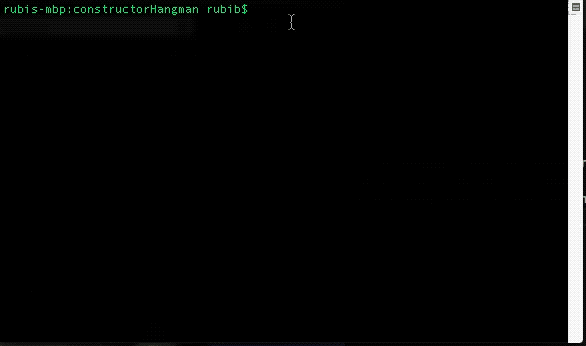

# ConstructorHangman
## By Perla E. Ballesteros

## Description:
ConstructorHangman is a command line app, which allows users to play hangman. User has seven tries to guess a word. After each word is guessed, user can guess a new word, else a new word is chosen automatically. The app was written using constructors as well as providing practice with working with different files (module.exports).
